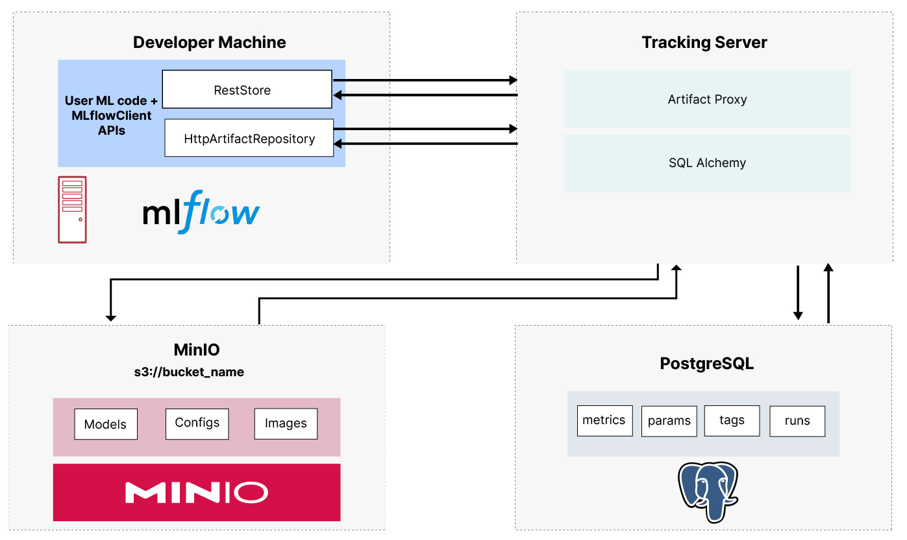

# MLflow Remote Tracking Server 

This repository contains a Dockerfile to build a Docker image for the MLflow Remote Tracking Server. The MLflow Remote Tracking Server is a standalone server that can be used to store MLflow experiments and runs in a central location. This allows multiple users to collaborate on the same MLflow experiments and runs.

Their are three main components to the Tracking Server:
- **Backend Storage**: The backend store is a core component in MLflow Tracking where MLflow stores metadata for Runs and experiments such as: parameters, metrics, tags, and artifacts. We'll be using [PostgreSQL](https://www.postgresql.org/) for this purpose.
- **Artifact Storage**: The artifact storage is a shared location where the artifacts for each run are stored. This can be a local directory, an S3 bucket, or an Azure Blob Storage container. We'll be using S3 like storage, [MINIO](https://min.io/), for this purpose.
- **Tracking Server**: The tracking server is a RESTful server that provides a central location to log and query MLflow experiments and runs.

The overall architecture of the MLflow Remote Tracking Server is shown below:




## Getting Started

### Prerequisites

- [Docker](https://docs.docker.com/get-docker/)
- [Docker Compose](https://docs.docker.com/compose/install/)

### Running the MLflow Remote Tracking Server

1. Clone this repository:
    
    ```bash
    git clone https://github.com/AshishSinha5/mlflow-docker.git
    cd mlflow-docker
    ```

2. Update the `.env` file to reflect your desired configuration:

3. Start the MLflow Remote Tracking Server:

    ```bash
    docker-compose up -d
    ```

4. In the client code, set the following environment variables to point to the MLflow Remote Tracking Server:

    ```bash
    export MLFLOW_TRACKING_URI= **your machine IP**
    export MLFLOW_S3_ENDPOINT_URL= **your s3 endpoint url**
    export AWS_ACCESS_KEY_ID= **your access key**
    export AWS_SECRET_ACCESS_KEY= **your secret key**
    ```

5. You can now access the MLflow UI by navigating to `http://your_machine_ip:port` in your web browser.

